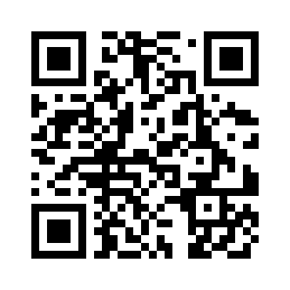

<!DOCTYPE html>
<html lang="fa" dir="rtl">
<head>
  <meta charset="UTF-8">
  <meta name="viewport" content="width=device-width, initial-scale=1">
  <title>کمک به مردم غزه | Help Gaza</title>
  
</head>
<body>

  <h1>🕊 کمک به مردم غزه | Help Gaza</h1>
  
<strong>دست‌های ما، امیدی برای آن‌ها</strong> <em>Our hands, their hope</em>

  

    <h2>📢 هدف ما | Our Mission</h2>
    
در این روزهای سخت، مردم غزه نیازمند کمک‌های فوری انسانی هستند. این وب‌سایت برای جمع‌آوری مستقیم کمک‌های مردمی و رساندن آن‌ها به نیازمندان واقعی ایجاد شده است.

    
In these difficult times, the people of Gaza urgently need humanitarian aid. This website is created to collect direct donations and deliver them to those in need.

  

  

    <h2>💸 کمک با تتر (USDT - TRC20) | Donate with Tether</h2>
    
<strong>آدرس کیف پول:</strong> <code>TAZPdj6UJWZdLETSrHy5DiKwiXYtnna4NF</code>

    
📷 یا کد QR زیر را اسکن کنید:

    
    
🔺 فقط تتر (USDT) روی شبکه TRC20 ارسال شود.

    
🔺 Send only USDT on the TRC20 network.

  

  

    <h2>💳 کمک ریالی | Bank Transfer (Inside Iran)</h2>
    

      <strong>شماره کارت:</strong> 6104 3387 6702 6715 
      <strong>بانک:</strong> ملت 
      <strong>به نام:</strong> مومن نورزاد
    

    

      <strong>Card Number:</strong> 6104 3387 6702 6715 
      <strong>Bank:</strong> Mellat 
      <strong>Account Holder:</strong> Momin Noorzad
    

  

  

    <h2>📞 تماس با ما | Contact</h2>
    <ul>
      <li>📱 واتساپ:00989962964153 </li>
      <li>📧 ایمیل: <a href="mailto:Mominnoorzad1@gmail.com">Mominnoorzad1@gmail.com</a></li>
    </ul>
    

      <ul>
        <li>📱 WhatsApp: +98 996 296 4153</li>
        <li>📧 Email: Mominnoorzad1@gmail.com</li>
      </ul>
    

  

  <footer>
    © 2025 مومن نورزاد | Created to support the people of Gaza
  </footer>

</body>
</html>
